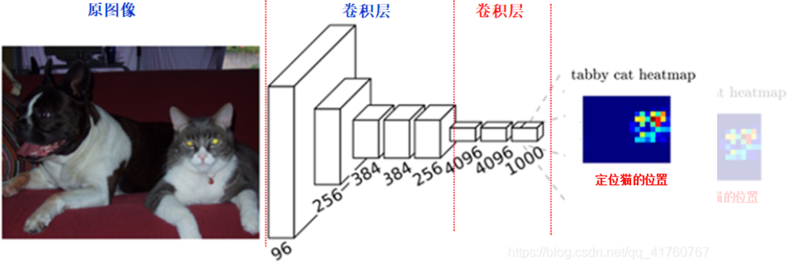

# CVwork
## 计算机图像作业
## 图像分割
使用pytorch实现了图片中包的轮廓的分割

在传统的CNN网络中，在最后的卷积层之后会连接上若干个全连接层，将卷积层产生的特征图（feature map）映射成为一个固定长度的特征向量。一般的CNN结构适用于图像的分类任务，因为它最后得到输入图像的分类的概率

FCN是对图像进行像素级的分类（也就是每个像素点都进行分类），从而解决了语义级别的图像分割问题

FCN的做法是将最后的全连接层替换为卷积核，即该网络中全是卷积层连接

与CNN在卷积层后使用全连接层得到固定长度的特征向量进行分类不同,FCN可以接受任意尺寸的输入图像，采用反卷积层对最后一个卷基层的特征图（feature map）进行上采样，使它恢复到输入图像相同的尺寸，从而可以对每一个像素都产生一个预测，同时保留了原始输入图像中的空间信息

经过多次卷积后，图像的分辨率越来越低，为了从低分辨率的热图heatmap恢复到原图大小，以便对原图上每一个像素点进行分类预测，需要对热图heatmap进行反卷积，也就是上采样。上采样有三种方法：

1.双线性插值上采样

2.反卷积上采样

3.反池化上采样

这里用反卷积上采样

反卷积上采样需要训练，但能更好的还原特征图

